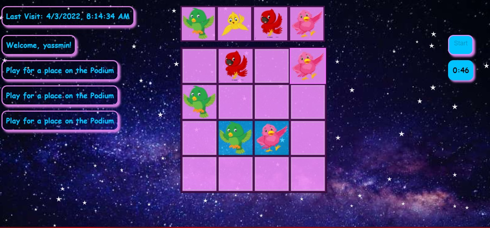
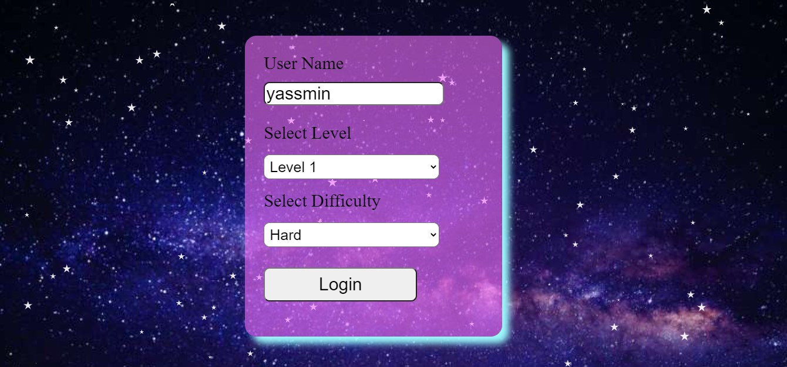
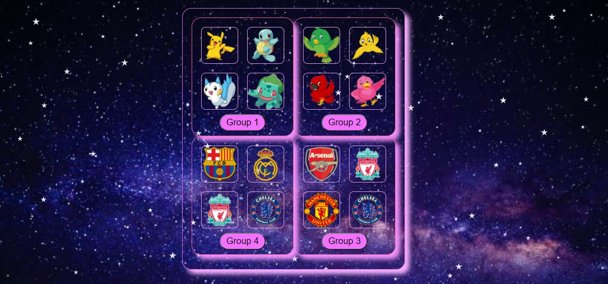
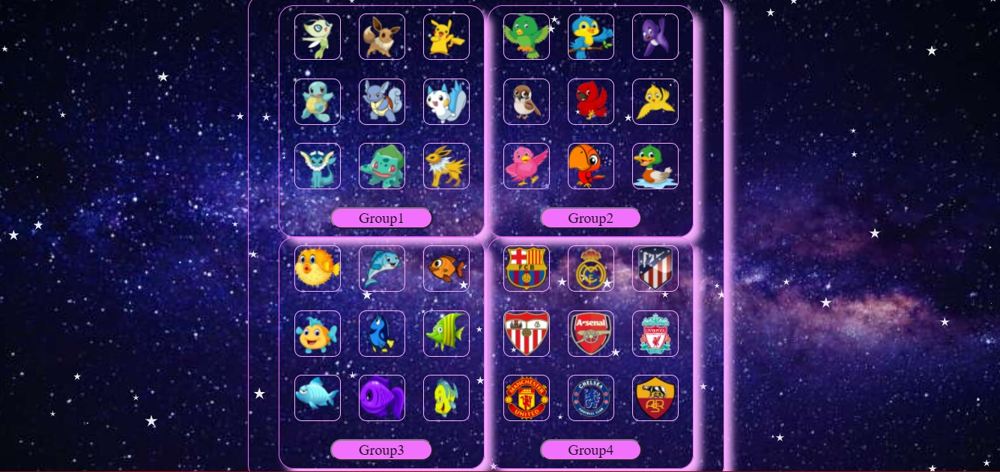
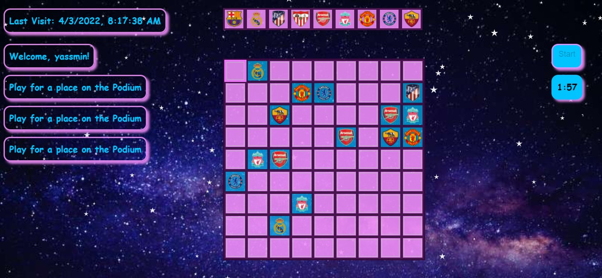
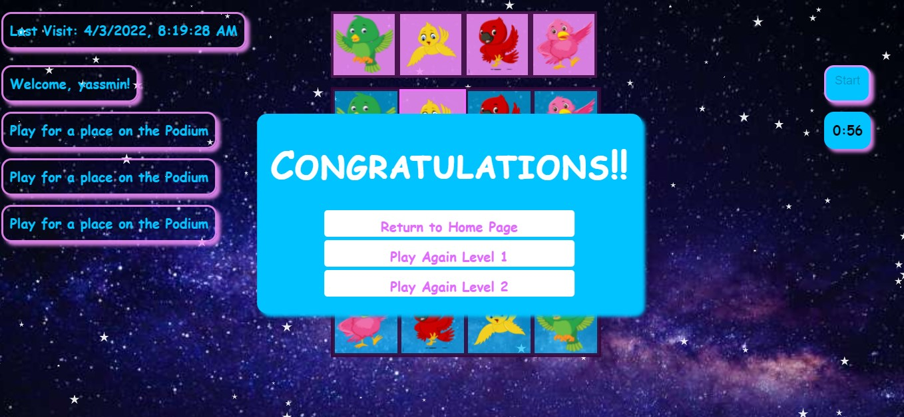
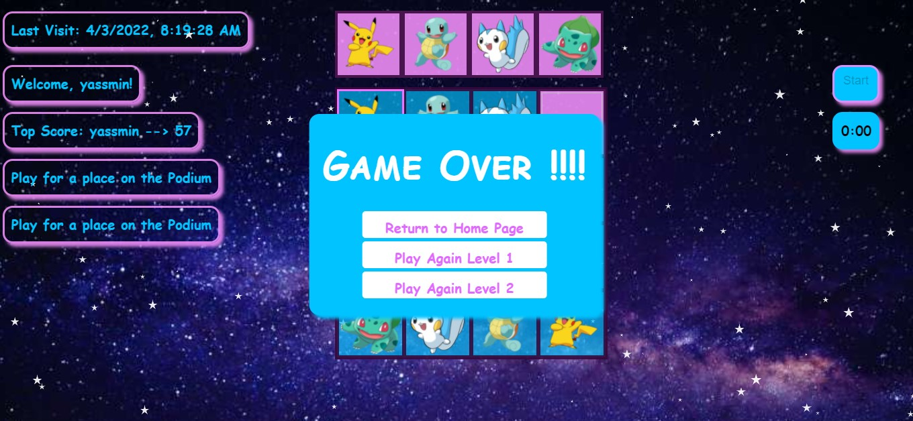

# Soduku for Kids

#### Soduku for Kids (Browser Game)
                                                
Soduku game for kids: includes 2 levels (4x4) & (9x9) timer runs out at 1 minute for (4x4) & 2 minutes for(9x9) 
Game also includes 4 different groups of images to use instead of numbers in the gallery section. game keeps track of user's last login and
tracks score for the top 3 players in each level

## Installation:
1. Clone this project on your machine
2. Install visual studio code on your machine (or any live server application that you can use to run this project)
3. From vs code install the live server extension
4. Run Register.html in your favourite browser from vs code live server and follow on screen instructions
  
## How to play:
1.Use arrows to navigate through the grid and use numbers 1 through 4 to insert an image into that tile (4x4) & 1 through 9 in (9x9)
2.Use the mouse to navigate to a certain tile for a better user experience. Make sure to win before time runs out and compete for a place on the podium!
  
## Technologies used:
HTML 
CSS
JAVASCRIPT

## SnapShots

    
    
    

 

     
    
    

 
## Credits:
- Alaa Gamal
- Omar Hussien
- Yassmin Hamdy : @yassmin95
- Youssef Abdelnasser

## License
- feel free to check out our project, use it ...contribute .... have fun! :)
- Pull requests are welcome. For major changes, please open an issue first to discuss what you would like to change.

  
